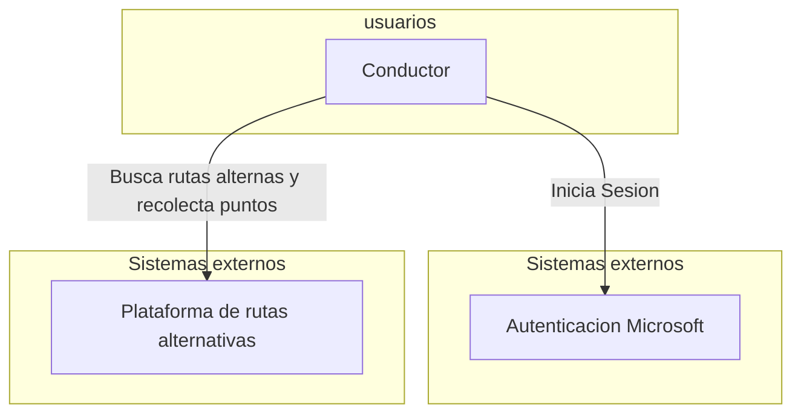

# Especificacion de requisitos de software

Proyecto: Plataforma para la gamificacion a traves del uso de rutas alternativas para la ciudad de Bogotá

# Ficha del documento

| Fecha | version | Autor | Verificado | Observaciones |
|-------|---------|-------|------------|---------------|
|       |         |       |            |               |

## Contenido

## 1 Introdución

TODO: Redactar un parrafo donde se de una introduccion al contenido de este documento

### 1.1 Proposito

En este documento se define las especificaciones funcionales y no funcionales de la plataforma de gamificación sobre el uso de rutas alternativas para la ciudad de Bogotá. Éste sera utilizado como guía para clientes y desarrolladores

### 1.2 Alcance

TODO: redactar despues

### 1.3 Personal Involucrado

| Nombre                  | Julian Roa                                       |
|-------------------------|--------------------------------------------------|
| Rol                     | Desarrollador                                    |
| Categoria Profesional   | Ingeniero Sistemas                               |
| Responsabilidad         | Diseñar, desarrollar, implementar bases de datos |
| Informacion de contacto | jsantiagoroa@ucompensar.edu.co                   |

### 1.4 Definiciones, acronimos y abreviaturas

| Nombre  | Descripción                                          |
|---------|------------------------------------------------------|
| Usuario | Persona que usará el sistema para gestionar procesos |
| ERS     | Especificación de Requisitos Software                |
| RF      | Requerimiento Funcional                              |
| RNF     | Requerimiento No Funcional                           |

### 1.5 Referencias

### 1.6 Resumen

## 2 Descripcion general

### 2.1 Perspectiva del producto

