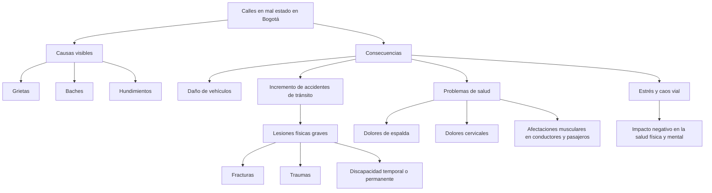

# Julian Santiago Roa Garzon  

**Dame soluciones tecnológicas para solucionar cada una de estas problemáticas que se ven en el día a día en la ciudad de Bogotá**

# 🧱 1. Detección automática de daños viales con IA y visión artificial (calles en mal estado)

* ¿Por qué es clave?
* En Bogotá, muchas calles presentan deterioro avanzado y la reparación suele depender de reportes manuales o inspecciones demoradas. Esto retrasa las intervenciones necesarias.
* Solución:

* Instalación de cámaras en buses, taxis y vehículos de transporte público para escanear el estado de la vía con algoritmos de visión artificial.

* Análisis automático de baches, grietas o hundimientos.

* Priorización de zonas críticas mediante mapas de calor generados por IA.

*  Notificaciones en tiempo real a entidades como el IDU o la Alcaldía para intervención rápida.
  # 🛠️ 2. Plataforma ciudadana de reporte y seguimiento de daños (participación ciudadana + tecnología)
* ¿Por qué es clave?
* Muchas veces los ciudadanos detectan los daños primero, pero no tienen canales eficientes para reportarlos o hacerles seguimiento.

* Solución:

* App o plataforma web para que cualquier ciudadano pueda tomar una foto y reportar el lugar exacto de un daño vial con GPS.

* Seguimiento del estado del caso en tiempo real (como un sistema de peticiones, quejas y reclamos).

* Sistema de priorización automática según la cantidad de reportes por zona.

* Integración con datos de sensores para validar y complementar la información.
# 🧪 3. Uso de materiales inteligentes y sensores para mantenimiento predictivo (infraestructura vial deficiente)
* ¿Por qué es clave?
* El mantenimiento correctivo sale caro y es tardío. La clave es anticiparse al deterioro antes de que la vía colapse.

* Solución:

* Implementar asfaltos inteligentes con sensores embebidos que detecten humedad, peso excesivo o desgaste.

* Uso de drones para inspecciones aéreas regulares sin interferir en el tráfico.

* Plataforma de mantenimiento predictivo basada en datos para planear reparaciones antes de que aparezcan baches visibles.
el 
# 🧩 Idea seleccionada: Detección automática de daños viales con IA y visión artificial
* Esta opcion que nos da la IA porque con los mismo vehiculos que transitan por esta ciudad se pueden usar como sensores moviles que identifican el estado de las vias
