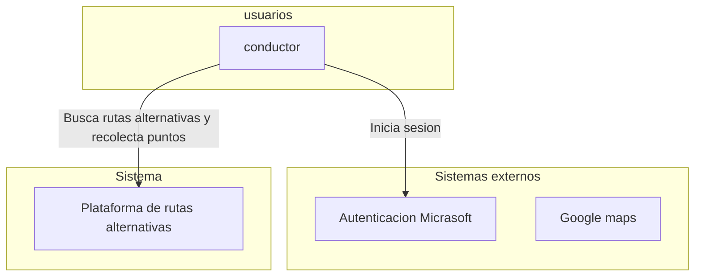

# Especificacion de requisitos de software

Proyecto: Plataforma para la gamificacion a traves del uso de rutas alternativas para la ciudad de Bogotá

# Ficha del documento

| Fecha | version | Autor | Verificado | Observaciones |
|-------|---------|-------|------------|---------------|
|       |         |       |            |               |

## Contenido

## 1 Introducción 
TODO: redactar un parrafo donde se de una introduccion al contenido de este documento

### 1.1 Proposito
En este documento se define las especificaciones y no funcionales de la plataforma de gamificacion sobre el uso de rutas alternativas para la ciudad de bogota. Este sera utiloizadp como guia para clientes y desarrolladores 

### 1.2 Alcance

TODO: redactar despues

### 1.3 Personal involucrado
| Nombre                  | William Torres                                                                        |
|-------------------------|---------------------------------------------------------------------------------------|
| Rol                     | Desarrollador                                                                         |
| Responsabilidad         | Diseñar, desarrollar e implementar el backend del sistema, incluido la base de datos. |
| Información de contacto | Wfernandotorres@ucompensa.edu.co                                                      |

### 1.4 Definiciones. acronimos y abreviaturas

| Nombre  | Descripción                                          |
|---------|------------------------------------------------------|
| Usuario | Persona que usará el sistema para gestionar procesos |
| ERS     | Especificación de Requisitos Software                |
| RF      | Requerimiento Funcional                              |
| RNF     | Requerimiento No Funcional                           |

### 1.5 Referencias

 ### 1.6 Resumen

 ### 2 Descripcion general

 ### 2.1 Perspéctiva del producto

