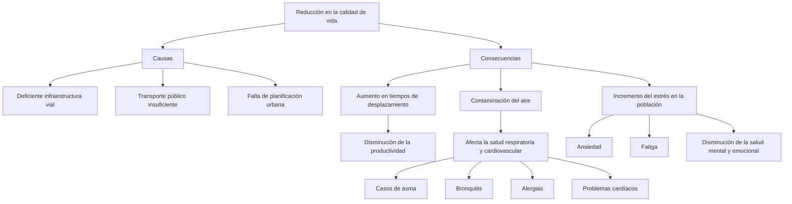

# William Fernando Torres Barrera

* Rutas principales congestionadas
  
"En esta ciudad se ven muchas problemáticas gracias al tráfico en muchas de las vías principales como las autopistas y    avenidas, como la Autopista Norte, la Avenida Caracas, la Calle 80 y la Avenida Boyacá. Estas vías la mayor parte del día están congestionadas, y más si es en hora pico"

**Dame soluciones tecnológicas para solucionar cada una de estas problemáticas que se ven en el día a día en la ciudad de Bogotá**

# 🚌 1. Plataforma integrada de movilidad (transporte público insuficiente)

* ¿Por qué es clave?
* Bogotá tiene un sistema fragmentado: TransMilenio, SITP, taxis, apps privadas y biciusuarios no están sincronizados.

* Solución:Una app única que integre todos los modos de transporte (TransMilenio, SITP, taxis, ciclorrutas, transporte compartido).

* Información en tiempo real de frecuencias, tiempos de espera, rutas y congestión.

* Pagos digitales con una sola tarjeta o código QR para todos los medios.

# 🚦 2. Sistema inteligente de gestión del tráfico (rutas congestionadas)

* ¿Por qué es clave?
* Las principales vías de Bogotá (Autopista Norte, Av. Boyacá, Calle 80) colapsan a diario, en parte por semáforos ineficientes y mala distribución del flujo vehicular.

* Solución:Semáforos inteligentes con sensores y algoritmos que ajustan su tiempo en tiempo real.

* Cámaras y sensores que analizan patrones de tráfico y sugieren rutas alternas.

* Integración con apps de navegación para redirigir vehículos automáticamente.

# 🌫️ 3. Monitoreo ambiental con sensores IoT (contaminación del aire)

* ¿Por qué es clave?
* Bogotá sufre altos niveles de contaminación, sobre todo en zonas con tráfico pesado y poca ventilación como Kennedy o Fontibón.

* Solución:Instalación de sensores de calidad del aire en puntos estratégicos.

* Visualización de datos en tiempo real en apps ciudadanas y plataformas de gobierno.

* Restricción automatizada de circulación de vehículos contaminantes en zonas críticas.

* Incentivos al uso de transporte limpio o eléctrico.

# 🚦 2. Sistema inteligente de gestión del tráfico (rutas congestionadas) (Idea seleccionada)
* Esta me parece muy interasante porque agrega sensores en cada semaforo lo que identifica si el trafico esta congestionado o si va
bien, esto facilita el trafico y es una idea bastante innovadora, incluso con una app se puede facilitar la gestion de estos sensores y camaras
