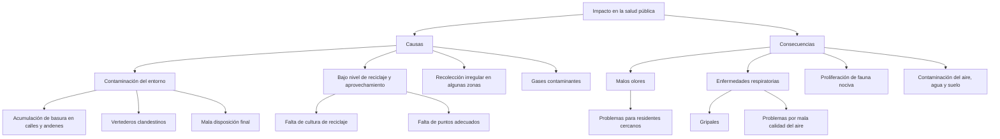

# Harold Andres Pava Perez

**♻️ 1. Sensores inteligentes en contenedores de basura (IoT + Big Data)**

* ¿Por qué es clave?
* Muchos contenedores se desbordan mientras otros permanecen vacíos, generando ineficiencia en la recolección.

* Solución:

 * Colocar sensores de nivel de llenado en contenedores estratégicos.

* Plataforma de control que optimice rutas de recolección según necesidad real.

* Alertas automáticas a operadores cuando un contenedor esté por desbordarse.

* Panel de datos para la UAESP y operadores de aseo.

**📱 2. Plataforma ciudadana de reciclaje y puntos limpios (participación ciudadana + tecnología)**

* ¿Por qué es clave?
* El reciclaje en Bogotá aún es bajo porque los ciudadanos no saben dónde ni cómo disponer correctamente sus residuos.

* Solución:

* App o web donde los ciudadanos localicen el punto de reciclaje más cercano.

* Sistema de recompensas digitales (puntos, descuentos en transporte, beneficios en comercios) por reciclar.

* Integración con rutas de recicladores de oficio para mejorar su visibilidad y eficiencia.

* Reporte ciudadano de basureros ilegales o acumulación en vía pública.

**🚛 3. Vehículos de recolección inteligentes con IA y análisis predictivo**

* ¿Por qué es clave?
* La recolección se hace en horarios fijos y muchas veces no corresponde a la demanda real, lo que genera congestión y * * zonas sucias.

* Solución:

* Camiones equipados con GPS y algoritmos de optimización de rutas.

* IA para predecir zonas con mayor generación de basura según población, comercio y eventos.

* Programación dinámica de turnos y recorridos según la demanda real.

* Integración con los sensores de contenedores para rutas inteligentes.

**🧩 Idea seleccionada: Sensores inteligentes en contenedores de basura (IoT + Big Data)**

* Con esta opción se pueden optimizar rutas de recolección, reducir costos operativos y mejorar la limpieza de la ciudad, * * mientras se generan datos útiles para políticas públicas de residuos.
